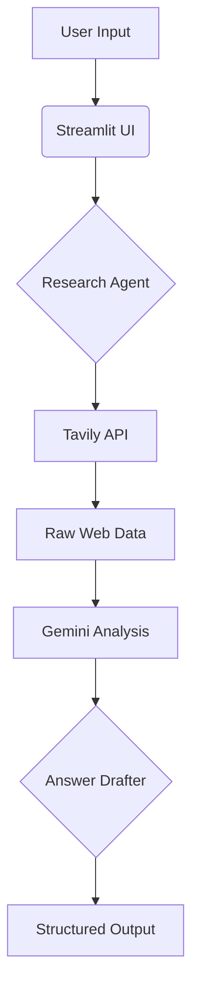

# KaironAI - AI Research Assistant  
**A Production-Grade Dual-Agent System for Intelligent Web Research**  

[](https://www.python.org/)
[](https://streamlit.io/)
[](https://langchain.com/langgraph)

## 🚀 Project Overview  
A sophisticated AI system demonstrating modern LLM orchestration capabilities, featuring:  
✅ **Dual-Agent Architecture** (Research + Answer Drafting Agents)  
✅ **Web Crawling** with Tavily API integration  
✅ **AI-Powered Analysis** using Google Gemini Pro  
✅ **Production-Ready Workflow** with LangGraph  
✅ **Interactive Web UI** built with Streamlit  

**Key Technical Showcases**:  
- Clean separation of concerns between agents  
- Robust error handling and API management  
- Environment configuration best practices  
- Modular and extensible architecture  

---

## 🛠 Technical Stack  
| Component              | Technology           | Purpose                          |
|------------------------|----------------------|----------------------------------|
| **Core Framework**     | Python 3.10          | Base programming language        |
| **Workflow Engine**    | LangGraph            | Agent orchestration              |
| **AI Models**          | Google Gemini Pro    | Research analysis & answer generation |
| **Web Interface**      | Streamlit            | User interaction layer           |
| **Web Crawling**       | Tavily API           | Real-time web research           |
| **Configuration**      | python-dotenv        | Secure credential management     |

---

## 🧠 System Architecture  

---

## Key Components

### Research Agent (`research_agent.py`)
- **Web Crawling and Data Aggregation**: Handles the crawling of web pages and aggregates data from various sources.
- **Data Preprocessing and Validation**: Preprocesses and validates data to ensure accuracy and quality.
- **Error Handling for API Failures**: Implements robust error handling to manage API failures gracefully.

### Answer Drafter (`answer_drafter.py`)
- **LLM-Powered Response Generation**: Generates responses using a large language model.
- **Markdown Formatting**: Formats the generated content in Markdown.
- **Quality Assurance Checks**: Conducts quality assurance checks to maintain response standards.

## ⚙️ Installation
**Prerequisites:**

- **Python 3.10+**
- **API keys: Tavily & Google AI Studio**

# Clone repository
```
git clone https://github.com/yourusername/KaironAI.git
cd KaironAI

# Create virtual environment
python -m venv venv
source venv/bin/activate  # Windows: venv\Scripts\activate

# Install dependencies
pip install -r requirements.txt

# Configure environment
echo "TAVILY_API_KEY=your_tavily_key" > .env
echo "GOOGLE_API_KEY=your_gemini_key" >> .env
```
---
# Usage

## Start the application:
```
streamlit run src/app.py
```
## Example Workflow:

- Enter query: "Explain quantum computing like I'm 5".
- Research Agent gathers web data.
- Answer Drafter generates structured response.
-View formatted output in web UI.

---
```
src/
├── agents/            # Core AI components
│   ├── research_agent.py  # Web research implementation
│   └── answer_drafter.py  # Response generation logic
├── utils/             # Helper modules
│   ├── config.py      # Environment configuration
│   └── tavily_wrapper.py # API client wrapper
├── app.py             # Streamlit UI entrypoint
└── main.py            # LangGraph workflow setup
```
